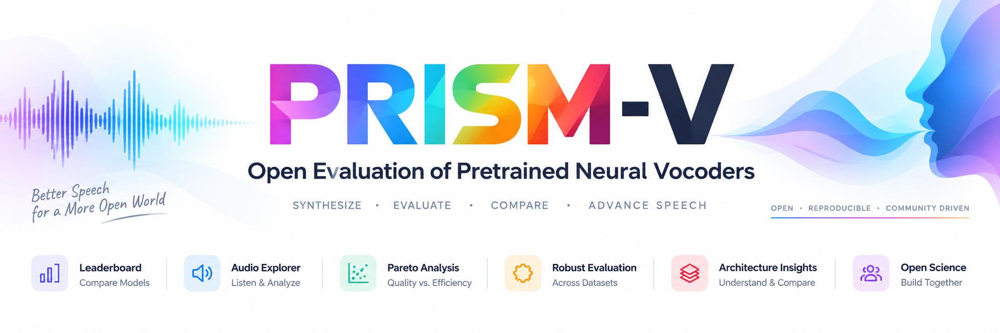

<div align="center">



# 🎙️ PRISM-V: A Multidimensional Evaluation of Pretrained Neural Vocoders for Speech Synthesis
### An Open Benchmark for Neural Vocoder Evaluation

[](https://iamshreeji-copy2.github.io/open_vocoder_leaderboard/)
[](#-citation)

<hr/>

[](https://opensource.org/licenses/MIT)
[](https://creativecommons.org/licenses/by/4.0/)
[](https://www.python.org/)
[](https://iamshreeji-copy2.github.io/open_vocoder_leaderboard/)
[](https://iamshreeji-copy2.github.io/open_vocoder_leaderboard/#models)
[](https://iamshreeji-copy2.github.io/open_vocoder_leaderboard/#methodology)
[](https://iamshreeji-copy2.github.io/open_vocoder_leaderboard/#audio-explorer)
[](https://github.com/iamshreeji-copy2/open_vocoder_leaderboard/pulls)

<p align="center">
  <a href="#-news-and-updates">News</a> •
  <a href="#-what-is-prism-v">What is PRISM-V?</a> •
  <a href="#-key-features">Key Features</a> •
  <a href="#-evaluated-neural-vocoders">Models</a> •
  <a href="#-evaluation-corpora">Corpora</a> •
  <a href="#-quick-start--local-preview">Quick Start</a> •
  <a href="#-submitting-a-new-vocoder">Submit Model</a> •
  <a href="#-citation">Citation</a>
</p>

</div>

---

## 📢 News and Updates

- **[Sept 2026]** **PRISM-V Static Web Platform Launched!** Interactive client-side leaderboard and Audio Explorer with genuine Time vs Amplitude waveform rendering live at **[iamshreeji-copy2.github.io/open_vocoder_leaderboard](https://iamshreeji-copy2.github.io/open_vocoder_leaderboard/)**.
- **[Aug 2026]** Benchmarking completed across 15 open-source neural vocoder checkpoints spanning GAN, Flow, Transformer, and Diffusion paradigms across 4 diverse speech corpora.
- **[July 2026]** Montreal Forced Aligner (MFA) phoneme diagnostic pipeline integrated to track fine-grained phonemic class fidelity (vowels, fricatives, stops, nasals, approximants).

---

## 🔬 What is PRISM-V?

**PRISM-V** (**P**erceptual, **R**econstruction, **I**ntelligibility, **S**peaker, and **M**odel Efficiency for **V**ocoders) is an open, standardized scientific benchmark and interactive leaderboard for evaluating pretrained neural vocoders in modern text-to-speech (TTS) and speech-to-speech synthesis pipelines.

Rather than relying on isolated single-corpus PESQ figures or inconsistent community evaluations, PRISM-V executes an identical, reproducible protocol evaluating:

1. **Acoustic Quality & Reconstruction Fidelity**: Objective metrics including PESQ-WB, Mel-Cepstral Distortion (MCD), STOI, Pitch RMSE (F0), and Voiced/Unvoiced F1-score.
2. **Cross-Corpus Generalization & Robustness**: Out-of-domain performance on multi-speaker narrative, accented speech, and real-world noisy acoustic conditions without re-training or fine-tuning.
3. **Deployment & Hardware Efficiency**: Throughput (xRT), Real-Time Factor (RTF), synthesis latency (ms), model footprint, and peak GPU VRAM consumption.
4. **Phonemic Diagnostic Sensitivity**: Alignment-based phoneme-class error heatmaps isolating acoustic degradation across vowels, stops, fricatives, and nasals.

```text
                               ┌────────────────────────────────────────────────────────┐
                               │             PRISM-V Evaluation Framework               │
                               └──────────────────────────┬─────────────────────────────┘
                                                          │
                    ┌─────────────────────┬───────────────┴───────────────┬─────────────────────┐
                    ▼                     ▼                               ▼                     ▼
          Quality & Fidelity    Cross-Corpus Robustness         Hardware Efficiency       Phonemic Diagnostics
          • PESQ-WB, MCD, STOI  • LJSpeech (Studio Clean)       • Throughput (xRT)        • Vowels & Stops
          • F0-RMSE, V/UV F1    • LibriTTS (Audiobook Prosody)  • Real-Time Factor (RTF)  • Fricatives & Affricates
          • Spectral Envelope   • VCTK (109 Regional Accents)   • Latency & Peak VRAM     • Nasals & Approximants
                                • Free_ST (Mobile Noise & Rev)
```

---

## ✨ Key Features

- **⚡ Zero-Cost Client-Side Architecture**: Built with lightweight HTML, Tailwind CSS, and Plotly.js — delivers instant sorting, multi-corpus PESQ recomputation, and instant CSV/JSON exports with zero compute server costs.
- **🎧 Interactive Audio Explorer**: Listen to 24 kHz reference recordings side-by-side with synthesized audio outputs from any two models with synchronized dual playback.
- **📈 Authentic Acoustic Waveforms**: Displays real Time (s) vs Amplitude ($-1.0$ to $+1.0$) envelopes extracted from the true WAV recordings with real-time playhead tracking.
- **⚖️ Side-by-Side Model Comparison**: Direct head-to-head comparison cards and 5-axis radar charts across GAN, Flow, Transformer, and Diffusion architectures.
- **📉 Pareto Frontier Visualizations**: Identifies optimal trade-offs along Quality vs Latency, Quality vs VRAM, and Quality vs Parameter count frontiers.

---

## 📦 Evaluated Neural Vocoders

PRISM-V benchmarks **15 representative neural vocoders** covering all major generative speech synthesis paradigms:

| Paradigm | Models Evaluated | Sampling Rate | Description |
|---|---|---|---|
| ⚡ **Generative Adversarial (GAN)** | BigVGAN-v2, BigVGAN-v1, HiFi-GAN (V1, V2, V3), UnivNet, MelGAN | 24 kHz / 22.05 kHz | Multi-period / multi-scale discriminators with fast parallel synthesis. |
| 🌊 **Flow-Based** | WaveGlow | 22.05 kHz | Invertible normalizing flows with exact log-likelihood training. |
| 🪟 **Fourier / Transformer** | Vocos, APNet2 | 24 kHz | Magnitude and phase prediction in the frequency domain with ultralow latency. |
| 🌫️ **Diffusion SDE** | FreGrad, PriorGrad, Diff-Wave, WaveGrad | 24 kHz / 22.05 kHz | Score-based iterative reverse diffusion with structured priors. |
| 🔁 **Autoregressive** | WaveNet | 24 kHz | Sample-by-sample causal dilated convolutions (gold-standard benchmark baseline). |

---

## 🧪 Evaluation Corpora

| Corpus | Acoustic Environment | Characteristics |
|---|---|---|
| **LJSpeech** | Clean Studio Recording | Single female speaker, professional recording booth, near-zero reverberation. |
| **LibriTTS** | Expressive Audiobook Narrative | Multi-speaker (test-clean + test-other), diverse dynamic range and prosody. |
| **VCTK** | Regional Accented Speech | 109 native speakers with British, Scottish, Irish, and Commonwealth accents. |
| **Free_ST** | Real-World Mobile Microphone | Mobile device microphones, environmental acoustic noise, and natural reverberation. |

---

## 🚀 Quick Start & Local Preview

To run the interactive leaderboard locally:

```bash
# 1. Clone the repository
git clone https://github.com/iamshreeji-copy2/open_vocoder_leaderboard.git
cd open_vocoder_leaderboard

# 2. Start a local HTTP server (Python 3.9+)
python3 -m http.server 8000
```

Open your browser and navigate to:
```
http://localhost:8000
```

---

## 🚢 GitHub Pages Deployment

This repository is designed to be hosted directly on GitHub Pages without any compute servers or quota limitations:

1. Navigate to **Repository Settings** → **Pages**.
2. Under **Build and deployment**:
   - **Source**: `Deploy from a branch`
   - **Branch**: `main`, Folder: `/ (root)`
3. Click **Save**. The website will be automatically built and served at:  
   `https://<username>.github.io/<repository-name>/`

---

## ➕ Submitting a New Vocoder

We welcome submissions of new or open-source neural vocoder checkpoints:

1. Subclass the standard `BaseVocoderAdapter` interface:

```python
from abc import ABC, abstractmethod
import torch

class BaseVocoderAdapter(ABC):
    """PRISM-V Standard Model Adapter Interface"""

    @abstractmethod
    def load_model(self, checkpoint_path: str, device: str = "cuda") -> None:
        """Load checkpoint weights and set model to eval mode."""
        pass

    @abstractmethod
    def synthesize(self, mel_spectrogram: torch.Tensor) -> torch.Tensor:
        """Synthesize 24 kHz or 22.05 kHz speech audio from mel spectrogram.
        
        Args:
            mel_spectrogram: Tensor of shape (B, n_mels, T)
        Returns:
            audio: Tensor of shape (B, num_samples)
        """
        pass
```

2. Generate synthesized speech on the 4 evaluation test sets using the benchmark standard mel-spectrogram parameters (80 mel bands, 1024 FFT, 256 hop size).
3. Submit a [Pull Request](https://github.com/iamshreeji-copy2/open_vocoder_leaderboard/pulls) with your adapter script, checkpoint URL, and synthesis logs.

---

## 📁 Repository Structure

```text
open_vocoder_leaderboard/
├── index.html               # Main single-page interactive leaderboard dashboard
├── README.md                # Comprehensive documentation and project guide
├── LICENSE                  # MIT License
├── assets/
│   ├── app.js               # Leaderboard logic, sorting, tab navigation, Plotly charts
│   ├── custom.css           # Design tokens, typography, dark mode styling
│   ├── Final_logo.png       # Official PRISM-V benchmark logo
│   ├── logo.png             # Benchmark banner logo
│   └── audio_samples/       # Authentic 24 kHz speech samples (64 WAV files)
└── data/
    ├── prism_data.js        # Bundled JSON dataset for instant standalone execution
    ├── prism_full_data.json # Full multidimensional evaluation records
    ├── waveform_data.js     # Extracted authentic acoustic envelope coordinates
    └── waveform_data.json   # Raw waveform envelope JSON database
```

---

## 🤝 Contributing

Contributions, questions, and feature suggestions are always welcome:

1. Fork the repository
2. Create a feature branch (`git checkout -b feature/model-support`)
3. Commit your changes (`git commit -m 'feat: add evaluation data for ModelX'`)
4. Push to your branch (`git push origin feature/model-support`)
5. Open a Pull Request

---

## 📙 Citation

If you use the PRISM-V benchmark, evaluated checkpoints, audio samples, or leaderboard codebase in your research, please cite:

```bibtex
@misc{purohit2026prismv,
  author       = {Ravindrakumar M. Purohit and Hemant A. Patil},
  title        = {PRISM-V: A Multidimensional Evaluation of Pretrained Neural Vocoders for Speech Synthesis},
  year         = {2026},
  howpublished = {\url{https://iamshreeji-copy2.github.io/open_vocoder_leaderboard/}},
  note         = {Open neural vocoder evaluation leaderboard}
}
```

---

## 📜 License

- **Benchmark Evaluation Data**: [Creative Commons Attribution 4.0 International (CC-BY 4.0)](https://creativecommons.org/licenses/by/4.0/)
- **Web Platform & Benchmark Code**: [MIT License](LICENSE)
